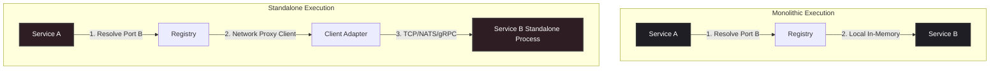

# Modulex

[](https://github.com/mediusfy/modulex/actions/workflows/ci.yml)
[](https://scorecard.dev/viewer/?uri=github.com/mediusfy/modulex)
[](https://pkg.go.dev/github.com/mediusfy/modulex)
[](https://goreportcard.com/report/github.com/mediusfy/modulex)
[](https://opensource.org/licenses/MIT)

**Modulex** is a Go library that orchestrates the lifecycle of modular applications and encourages clean architectural boundaries. It helps teams build feature modules that can run together in a single process today and be extracted into standalone services tomorrow without changing core business logic.

---

## What this Repository is Designed to Do

Modulex is built to solve a critical orchestration challenge: **how to initialize, start, and stop a set of interdependent feature modules in a deterministic order, while keeping their wiring configurable at the composition root.**

Specifically, it is designed to:
1. **Encourage Feature Decoupling:** Make it easy to depend on interface contracts (ports) rather than concrete implementations, so features can be wired locally or remotely at the composition root.
2. **Automate Topological DAG Lifecycles:** Analyze feature dependencies at startup, detect circular loops, and execute lifecycle stages (`Init`, `Start`, `Stop`) in strict topological order (and reverse order for teardown).
3. **Abstract Messaging Infrastructure:** Provide a generic `EventBus` interface that decouples modules from specific messaging frameworks (e.g. NATS, RabbitMQ, Kafka).
4. **Provide OpenTelemetry-Ready Tracing:** Automatically trace module initialization and startup cycles, and provide trace-safe concurrency helpers for background work.
5. **Enable Flexible Deployment Topologies:**
   * **Monolithic Run:** Register all feature modules locally. The service registry wires interfaces directly to in-process service implementations.
   * **Distributed Run (Microservices):** Register only the target module in its own standalone binary. For modules it depends on, the composition root registers network client adapters (HTTP/gRPC/NATS) instead, pointing to the external service.

---

## What Modulex Is (and Is Not)

Modulex is a **runtime lifecycle orchestrator and service locator**, not a compile-time dependency enforcer. It cannot prevent one Go package from importing another; that guarantee belongs to the Go compiler and, optionally, to a separate `go/analysis` static-analysis tool.

What it does provide:

- A deterministic startup and shutdown order.
- A typed, runtime service registry.
- A consistent pattern for registering local or remote implementations of the same interface.
- Trace-safe background task execution.

What it does **not** provide:

- Compile-time prevention of cross-feature imports.
- Automatic code generation for wiring.
- A microservices runtime, service mesh, or deployment platform.

---

## Pluggable Event Bus Interface

To prevent modules from tying themselves directly to a specific messaging broker, Modulex exposes a generic `EventBus` abstraction.

### 1. The EventBus Interface

```go
// EventHandler is a generic callback for incoming event payloads.
type EventHandler func(ctx context.Context, payload []byte) error

// EventBus abstracts the underlying message broker.
type EventBus interface {
	Publish(ctx context.Context, topic string, payload []byte) error
	Subscribe(ctx context.Context, topic string, handler EventHandler) error
	Close(ctx context.Context) error
}
```

### 2. Built-In Adapters (Drivers)

Modulex includes reference adapters for popular brokers. They are usable as-is,
but you should validate them against your own reliability and observability
requirements before production use. The Watermill driver shown below uses the
in-memory `GoChannel` implementation, which is ideal for local development and
tests.

#### NATS Driver
```go
import "github.com/mediusfy/modulex/nats"

// Wrap a standard *nats.Conn connection
eb := nats.NewEventBus(natsConn)
mgr, err := modulex.NewManager(modulex.WithEventBus(eb), modulex.WithLogger(logger), modulex.WithConfigLoader(configLoader))
if err != nil {
    // handle error
}
```

#### RabbitMQ Driver
```go
import "github.com/mediusfy/modulex/rabbitmq"

// Wrap a standard *amqp.Channel channel
eb := rabbitmq.NewEventBus(amqpChannel)
mgr, err := modulex.NewManager(modulex.WithEventBus(eb), modulex.WithLogger(logger), modulex.WithConfigLoader(configLoader))
if err != nil {
    // handle error
}
```

#### Watermill Driver
```go
import watermilladapter "github.com/mediusfy/modulex/watermill"

// Initialize Watermill in-memory (Go Channel)
eb := watermilladapter.NewEventBus(100, false, false)
mgr, err := modulex.NewManager(modulex.WithEventBus(eb), modulex.WithLogger(logger), modulex.WithConfigLoader(configLoader))
if err != nil {
    // handle error
}
```

#### Chi Router Integration
```go
import (
    gochi "github.com/go-chi/chi/v5"
    modulexchi "github.com/mediusfy/modulex/chi"
)

router := gochi.NewRouter()
mgr, err := modulex.NewManager(modulex.WithEventBus(eb), modulex.WithLogger(logger), modulex.WithConfigLoader(configLoader))
if err != nil {
    // handle error
}
if err := modulexchi.RegisterRouter(mgr, router); err != nil {
    // handle error
}
```

Modules that need the router resolve it in `Init`:

```go
func (m *Module) Init(ctx context.Context, reg modulex.Registry) error {
    router, err := modulexchi.ResolveRouter(reg)
    if err != nil {
        return err
    }
    router.Get("/api/incidents", m.listIncidents)
    return nil
}
```

### 3. InMemory Event Bus (For Testing)

Using the `EventBus` interface, you can write an `InMemoryEventBus` backed by simple Go channels/maps to test your business logic completely offline:

```go
type InMemoryEventBus struct {
	mu          sync.Mutex
	subscribers map[string][]modulex.EventHandler
}

func (eb *InMemoryEventBus) Publish(ctx context.Context, topic string, payload []byte) error {
	eb.mu.Lock()
	handlers := eb.subscribers[topic]
	eb.mu.Unlock()
	for _, h := range handlers {
		_ = h(ctx, payload)
	}
	return nil
}

func (eb *InMemoryEventBus) Subscribe(ctx context.Context, topic string, handler modulex.EventHandler) error {
	eb.mu.Lock()
	defer eb.mu.Unlock()
	eb.subscribers[topic] = append(eb.subscribers[topic], handler)
	return nil
}

func (eb *InMemoryEventBus) Close(ctx context.Context) error { return nil }
```

---

## Telemetry and Context Propagation

Modulex has an optional, pluggable `Tracer` interface. The `modulex/otel` package
adapts an OpenTelemetry `TracerProvider` so the core library does not force the
OpenTelemetry dependency on consumers who do not need tracing.

```go
import modulexotel "github.com/mediusfy/modulex/otel"

sr := tracetest.NewSpanRecorder()
tp := sdktrace.NewTracerProvider(sdktrace.WithSpanProcessor(sr))

mgr, err := modulex.NewManager(eb, logger, configLoader,
    modulex.WithTracer(modulexotel.NewTracer(tp)),
)
if err != nil {
    // handle error
}
```

### Preventing Telemetry Gaps

In Go, starting a background task using `go func()` breaks context propagation, leading to detached, orphaned spans (telemetry gaps).
To prevent this, the `Registry` provides a `Go` helper that handles trace context propagation and panic safety automatically:

```go
// Inside a module's Start method:
func (m *Module) Start(ctx context.Context, tracer trace.Tracer) error {
    _, err := m.registry.Go(ctx, "invoices.ProcessQueue", func(bgCtx context.Context) error {
        // bgCtx carries the parent span context from the caller.
        // Spans created here are correctly linked, preventing telemetry gaps.
        _, span := tracer.Start(bgCtx, "ProcessNextInvoice")
        defer span.End()

        // Do background work safely...
        return nil
    })
    return err
}
```

`Go` returns a `*TaskHandle` that can be awaited, and the manager guarantees that
all supervised tasks are cancelled and awaited before modules are stopped during
shutdown. Panic recovery is configurable via `WithPanicPolicy`.

### Verifying Spans (Asserting No Gaps)

To guarantee that your tracing pipeline is intact and that no developers are introducing gaps in spans, you can write unit tests using the OTel `tracetest` package to verify parent-child relations:

```go
func TestTracesNoGaps(t *testing.T) {
	// Set up memory span exporter
	sr := tracetest.NewSpanRecorder()
	tp := sdktrace.NewTracerProvider(sdktrace.WithSpanProcessor(sr))

	manager, err := modulex.NewManager(nil, logger, nil,
	    modulex.WithTracer(modulexotel.NewTracer(tp)),
	)
	require.NoError(t, err)
	manager.RegisterModule(&myModule{})

	// Initialize
	err = manager.InitModules(context.Background())
	require.NoError(t, err)

	// Fetch captured spans and verify parent-child lineage
	spans := sr.Ended()
	var parentSpan, childSpan sdktrace.ReadOnlySpan
	for _, s := range spans {
		if s.Name() == "InitModules" {
			parentSpan = s
		} else if s.Name() == "InitModule:my-module" {
			childSpan = s
		}
	}

	// Verify child span points directly to parent, ensuring no orphaned spans/gaps
	assert.Equal(t, parentSpan.SpanContext().SpanID(), childSpan.Parent().SpanID())
	assert.Equal(t, parentSpan.SpanContext().TraceID(), childSpan.SpanContext().TraceID())
}
```

---

## Architectural Decision Record (ADR-0029)

This section embeds the official architectural decision that defines the creation, standard, and deployment constraints of the `modulex` framework.

### Context & Problem Statement

As Go applications grow within a monorepo, features that start as simple internal modules often need to scale, compile, and deploy independently. However, Go developers commonly fall into the trap of tight coupling by importing concrete structures and adapters from other packages (e.g., calling a database helper directly or importing a controller). 

If Feature A directly imports Feature B's `service` or `adapters` packages, compilation boundaries are broken:
- Feature A cannot be compiled without pulling in Feature B's dependencies (causing bloated binaries).
- Circular package imports occur frequently.
- Extracting a feature into a standalone service requires a major rewrite.

We need a standardized framework and layout rules to enforce linear execution paths, clean interface segregation, and dynamic runtime wiring.

### Options Considered

* **Option 1: Compile-time Dependency Injection (e.g., Wire, Dig)**
  * *Pros:* Type-safe at compile time.
  * *Cons:* Requires highly complex setup configurations in `main.go`. Changing target topologies requires maintaining distinct, cumbersome compile-time configuration sets.
* **Option 2: Service Locator and Module Registry Pattern (`modulex`)**
  * *Pros:* Extremely low coupling. The core business logic is completely insulated. Topologies are selected at the composition root (the entry point `main.go`) by choosing to register either local modules or network proxy clients under the same interface names.
  * *Cons:* Registry resolution type-checks are performed at startup rather than compile-time.

### Confirming the Design

We confirm the selection of **Option 2** (the Service Locator and Module Registry Pattern). Modulex encourages clean hexagonal segregation and supports runtime topology mapping:



### Consequences

* **Positive:**
  * **Zero Code Modification:** Splitting a monolith to microservices involves changing *only* the registration block in the application's entrypoint (`main.go`).
  * **Strict Clean Deletion:** If a feature is deprecated, deleting its package directory does not break the compilation of other modules, since no other module imported its code.
  * **No Resource Leakage:** Reverse-order shutdowns ensure downstream DB connectors/event lines are terminated only after upstream services have stopped consuming them.
* **Negative:**
  * **Type Assertions:** Developers must cast resolved interfaces (`val.(ports.Service)`). Missing service registrations surface when a module calls `ResolveService`/`Resolve` during `Init`.

---

## Directory Standards

Every feature module using `modulex` must reside in its own package and strictly adhere to this layout:

* **`domain/`**: Entities, pure values, core business rules. Zero dependencies on other features.
* **`ports/`**: Clean interface contracts. Defines how the service can be called (inbound) and what it requires (outbound).
* **`service/`**: Core logic implementing the inbound ports using pure business logic (no DB/network drivers).
* **`adapters/`**: Houses all infrastructure mappings:
  * *Inbound:* HTTP controllers, NATS listeners.
  * *Outbound:* SQL repositories, API integrations.
  * *Client:* Client adapter (HTTP/NATS proxy) implementing `ports/` interfaces for standalone deployment mode.
* **`module.go`**: Implements the `modulex.Module` interface. Acts as the module's localized composition root.

---

## Getting Started

### Installation

```bash
go get github.com/mediusfy/modulex
```

### Usage Example

#### 1. Define a Module

```go
package database

import (
	"context"
	"github.com/mediusfy/modulex"
)

type Module struct {
	dbConn *Connection
}

func (m *Module) Name() string      { return "database" }
func (m *Module) DependsOn() []string { return nil } // No dependencies

func (m *Module) Init(ctx context.Context, reg modulex.Registry) error {
	m.dbConn = ConnectDB() // your database constructor
	// Register service for other modules to resolve
	return reg.RegisterService("database.Connection", m.dbConn)
}

// Stop is optional; implement it only when the module owns resources that must
// be released during shutdown.
func (m *Module) Stop(ctx context.Context) error { return m.dbConn.Close() }
```

#### 2. Declare a Dependent Module

```go
package incident

import (
	"context"
	"github.com/mediusfy/modulex"
)

type Module struct {
	svc Service
}

func (m *Module) Name() string      { return "incident" }
func (m *Module) DependsOn() []string { return []string{"database"} } // Boot database first

func (m *Module) Init(ctx context.Context, reg modulex.Registry) error {
	// Resolve dependency without importing any concrete implementation
	conn, err := reg.ResolveService("database.Connection")
	if err != nil {
		return err
	}

	m.svc = NewService(conn)
	return reg.RegisterService("incident.Service", m.svc)
}
```

---

## Typed Service Wiring

String-based service keys require unchecked type assertions. Modulex provides
compile-time typed keys and generic helpers:

```go
package ports

import "github.com/mediusfy/modulex"

type Service interface { /* ... */ }

var ServiceKey = modulex.NewKey[Service]("incident.Service")
```

```go
func (m *Module) Init(ctx context.Context, reg modulex.Registry) error {
    m.svc = service.New(repo)
    return modulex.Provide(reg, ports.ServiceKey, m.svc)
}
```

```go
func (m *OtherModule) Init(ctx context.Context, reg modulex.Registry) error {
    svc, err := modulex.Resolve(reg, ports.ServiceKey)
    if err != nil {
        return err
    }
    // svc is already typed as ports.Service
    m.incidentSvc = svc
    return nil
}
```

`Provide` and `Resolve` wrap the underlying string-keyed registry and return
`ErrServiceTypeMismatch` when the registered value does not match the key's
compile-time type.

## Capability interfaces

`modulex.Registry` is a composite of smaller capability interfaces. The
framework still passes the full `Registry` to `Module.Init`, but internal
helpers and constructors can depend on only the capabilities they need:

- `modulex.ServiceRegistry` – register and resolve services.
- `modulex.ServiceRegistrar` – register services only.
- `modulex.ServiceResolver` – resolve services only.
- `modulex.EventBusProvider` – access the event bus.
- `modulex.ConfigProvider` – load configuration.
- `modulex.LoggerProvider` – access the logger.
- `modulex.TaskSpawner` – start supervised background tasks.

For example, a constructor that only needs to register a service and read the
logger can accept the narrower interfaces:

```go
func NewService(reg modulex.ServiceRegistrar, log modulex.LoggerProvider) *Service {
    svc := &Service{logger: log.Logger()}
    _ = reg.RegisterService("my.Service", svc)
    return svc
}

func (m *Module) Init(ctx context.Context, reg modulex.Registry) error {
    m.svc = NewService(reg, reg)
    return nil
}
```

---

## Quickstart

See [`examples/quickstart`](./examples/quickstart/main.go) for a minimal,
runnable application that registers two modules, resolves a typed service, and
runs the full lifecycle.

```bash
go run ./examples/quickstart
```

---

## Deployment Topologies

The same domain interfaces can be wired as a monolith or as separate processes.
See [`examples/deployment`](./examples/deployment):

- [`examples/deployment/monolith`](./examples/deployment/monolith/main.go) registers
  the notification module and a consumer module in the same process. The consumer
  resolves the local service implementation via typed key.
- [`examples/deployment/remote`](./examples/deployment/remote) runs the notification
  service and the consumer as two separate processes. The consumer binary registers
  a `notification.RemoteModule` that provides an HTTP client adapter under the same
  typed key, so the consumer module itself does not change.

```bash
# Monolith
go run ./examples/deployment/monolith

# Remote (two processes)
go run ./examples/deployment/remote/notification-server
NOTIFICATION_URL=http://localhost:8080 go run ./examples/deployment/remote/consumer
```

---

## How Modulex Compares to Alternatives

| Approach | What it does best | Where Modulex differs |
|---|---|---|
| **Plain constructor injection** | Simple, type-safe, no dependencies | Modulex adds deterministic lifecycle ordering and runtime topology switching for large monorepos. |
| **Wire** | Compile-time dependency graphs | Modulex wires at runtime, so topology can change without re-running code generation. |
| **Fx (Uber)** | Rich dependency injection and lifecycle hooks | Modulex is smaller and exposes an explicit state machine; it does not use reflection for DI. |
| **Dig** | Runtime container with parameter objects | Modulex favors explicit `Init`/`Start`/`Stop` methods and typed service keys over a generic container. |

Modulex is a good fit when you need a small, predictable orchestrator that
encourages clean boundaries without taking over your entire application.

See [`docs/planning/comparison-with-alternatives.md`](./docs/planning/comparison-with-alternatives.md)
for a detailed comparison with plain constructor injection, Wire, Fx, and Dig.

---

## Documentation

- [Compatibility Policy](./COMPATIBILITY.md)
- [Comparison with Alternatives](./docs/planning/comparison-with-alternatives.md)
- [Error Handling](./docs/planning/error-handling-guide.md)
- [Lifecycle Guide](./docs/planning/lifecycle-guide.md)
- [Migration Guide](./docs/planning/migration-guide.md)
- [Support](./SUPPORT.md)
- [Security](./SECURITY.md)
- [Contributing](./CONTRIBUTING.md)
- [Task Supervision](./docs/planning/task-supervision-guide.md)

---

## License

This project is licensed under the MIT License - see the [LICENSE](LICENSE) file for details.
