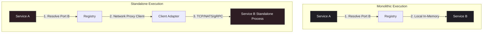

# Modulex

[](https://pkg.go.dev/github.com/mediusfy/modulex)
[](https://goreportcard.com/report/github.com/mediusfy/modulex)
[](https://opensource.org/licenses/MIT)

**Modulex** is an industry-standard Go library designed to orchestrate and enforce architectural boundaries in Go applications. 

---

## What this Repository is Designed to Do

Modulex is built to solve a critical architectural challenge: **how to build a modular monorepo application that can be run as a single monolithic process today, yet easily compile and deploy individual features as independent, standalone binaries in the future—without modifying core business logic.**

Specifically, it is designed to:
1. **Decouple Features at Compile-Time:** Prevent direct imports of concrete service implementations or database/network adapters between different feature modules. All feature-to-feature communication is handled via resolved interface boundaries (ports).
2. **Enforce Hexagonal Architecture Boundaries:** Provide a structured initialization registry where features register their public inbound ports and dynamically request outbound ports.
3. **Automate Topological DAG Lifecycles:** Analyze feature dependencies at startup to construct a Directed Acyclic Graph (DAG), detect circular loops, and execute lifecycle stages (`Init`, `Start`, `Stop`) in strict topological order (and reverse order for teardown).
4. **Abstract Messaging Infrastructure (Dependency Inversion):** Introduce a generic `EventBus` interface that decouples modules from specific messaging frameworks (e.g. NATS, RabbitMQ, Kafka).
5. **Provide Built-In OpenTelemetry (OTel) Tracing:** Automatically trace module initialization and startup cycles. Provide trace-safe concurrency mechanisms to ensure traces continue seamlessly in background goroutines.
6. **Enable Flexible Deployment Topologies:**
   * **Monolithic Run:** Register all feature modules locally. The service registry wires interfaces directly to in-process service implementations.
   * **Distributed Run (Microservices):** Register only the target module in its own standalone binary. For other modules it depends on, the composition root registers network client adapters (HTTP/gRPC/NATS) instead, pointing to the external service.

---

## Pluggable Event Bus Interface

To prevent modules from tying themselves directly to a specific messaging broker, Modulex exposes a generic `EventBus` abstraction.

### 1. The EventBus Interface

```go
// EventHandler is a generic callback for incoming event payloads.
type EventHandler func(ctx context.Context, payload []byte) error

// EventBus abstracts the underlying message broker.
type EventBus interface {
	Publish(ctx context.Context, topic string, payload []byte) error
	Subscribe(ctx context.Context, topic string, handler EventHandler) error
	Close(ctx context.Context) error
}
```

### 2. Built-In Adapters (Drivers)

Modulex includes production-ready adapters for popular brokers. To use them:

#### NATS Driver
```go
import "github.com/mediusfy/modulex"

// Wrap a standard *nats.Conn connection
eb := modulex.NewNATSEventBus(natsConn)
mgr := modulex.NewManager(router, eb, logger, configLoader)
```

#### RabbitMQ Driver
```go
import "github.com/mediusfy/modulex"

// Wrap a standard *amqp.Channel channel
eb := modulex.NewRabbitMQEventBus(amqpChannel)
mgr := modulex.NewManager(router, eb, logger, configLoader)
```

#### Watermill Driver
```go
import "github.com/mediusfy/modulex"

// Initialize Watermill in-memory (Go Channel)
eb := modulex.NewWatermillEventBus(100, false, false)
mgr := modulex.NewManager(router, eb, logger, configLoader)
```

### 3. InMemory Event Bus (For Testing)

Using the `EventBus` interface, you can write an `InMemoryEventBus` backed by simple Go channels/maps to test your business logic completely offline:

```go
type InMemoryEventBus struct {
	mu          sync.Mutex
	subscribers map[string][]modulex.EventHandler
}

func (eb *InMemoryEventBus) Publish(ctx context.Context, topic string, payload []byte) error {
	eb.mu.Lock()
	handlers := eb.subscribers[topic]
	eb.mu.Unlock()
	for _, h := range handlers {
		_ = h(ctx, payload)
	}
	return nil
}

func (eb *InMemoryEventBus) Subscribe(ctx context.Context, topic string, handler modulex.EventHandler) error {
	eb.mu.Lock()
	defer eb.mu.Unlock()
	eb.subscribers[topic] = append(eb.subscribers[topic], handler)
	return nil
}

func (eb *InMemoryEventBus) Close(ctx context.Context) error { return nil }
```

---

## Telemetry and Context Propagation

Modulex comes with native support for OpenTelemetry tracing to monitor the startup sequences and execution paths of your modules.

### Preventing Telemetry Gaps

In Go, starting a background task using `go func()` breaks context propagation, leading to detached, orphaned spans (telemetry gaps). 
To prevent this, the `Registry` provides a `Go` helper that handles trace context propagation and panic safety automatically:

```go
// Inside a module's Start method:
func (m *Module) Start(ctx context.Context) error {
    _, err := m.registry.Go(ctx, "invoices.ProcessQueue", func(bgCtx context.Context) error {
        // bgCtx carries the parent span context from the caller.
        // Spans created here are correctly linked, preventing telemetry gaps.
        _, span := m.registry.Tracer().Start(bgCtx, "ProcessNextInvoice")
        defer span.End()

        // Do background work safely...
        return nil
    })
    return err
}
```

`Go` returns a `*TaskHandle` that can be awaited, and the manager guarantees that
all supervised tasks are cancelled and awaited before modules are stopped during
shutdown. Panic recovery is configurable via `WithPanicPolicy`.

### Verifying Spans (Asserting No Gaps)

To guarantee that your tracing pipeline is intact and that no developers are introducing gaps in spans, you can write unit tests using the OTel `tracetest` package to verify parent-child relations:

```go
func TestTracesNoGaps(t *testing.T) {
	// Set up memory span exporter
	sr := tracetest.NewSpanRecorder()
	tp := sdktrace.NewTracerProvider(sdktrace.WithSpanProcessor(sr))
	otel.SetTracerProvider(tp)

	manager := modulex.NewManager(router, nil, logger, nil)
	manager.RegisterModule(&myModule{})

	// Initialize
	err := manager.InitModules(context.Background())
	require.NoError(t, err)

	// Fetch captured spans and verify parent-child lineage
	spans := sr.Ended()
	var parentSpan, childSpan sdktrace.ReadOnlySpan
	for _, s := range spans {
		if s.Name() == "InitModules" {
			parentSpan = s
		} else if s.Name() == "InitModule:my-module" {
			childSpan = s
		}
	}

	// Verify child span points directly to parent, ensuring no orphaned spans/gaps
	assert.Equal(t, parentSpan.SpanContext().SpanID(), childSpan.Parent().SpanID())
	assert.Equal(t, parentSpan.SpanContext().TraceID(), childSpan.SpanContext().TraceID())
}
```

---

## Architectural Decision Record (ADR-0029)

This section embeds the official architectural decision that defines the creation, standard, and deployment constraints of the `modulex` framework.

### Context & Problem Statement

As Go applications grow within a monorepo, features that start as simple internal modules often need to scale, compile, and deploy independently. However, Go developers commonly fall into the trap of tight coupling by importing concrete structures and adapters from other packages (e.g., calling a database helper directly or importing a controller). 

If Feature A directly imports Feature B's `service` or `adapters` packages, compilation boundaries are broken:
- Feature A cannot be compiled without pulling in Feature B's dependencies (causing bloated binaries).
- Circular package imports occur frequently.
- Extracting a feature into a standalone service requires a major rewrite.

We need a standardized framework and layout rules to enforce linear execution paths, clean interface segregation, and dynamic runtime wiring.

### Options Considered

* **Option 1: Compile-time Dependency Injection (e.g., Wire, Dig)**
  * *Pros:* Type-safe at compile time.
  * *Cons:* Requires highly complex setup configurations in `main.go`. Changing target topologies requires maintaining distinct, cumbersome compile-time configuration sets.
* **Option 2: Service Locator and Module Registry Pattern (`modulex`)**
  * *Pros:* Extremely low coupling. The core business logic is completely insulated. Topologies are selected at the composition root (the entry point `main.go`) by choosing to register either local modules or network proxy clients under the same interface names.
  * *Cons:* Registry resolution type-checks are performed at startup rather than compile-time.

### Confirming the Design

We confirm the selection of **Option 2** (the Service Locator and Module Registry Pattern). Modulex enforces clean hexagonal segregation and supports runtime topology mapping:



### Consequences

* **Positive:**
  * **Zero Code Modification:** Splitting a monolith to microservices involves changing *only* the registration block in the application's entrypoint (`main.go`).
  * **Strict Clean Deletion:** If a feature is deprecated, deleting its package directory does not break the compilation of other modules, since no other module imported its code.
  * **No Resource Leakage:** Reverse-order shutdowns ensure downstream DB connectors/event lines are terminated only after upstream services have stopped consuming them.
* **Negative:**
  * **Type Assertions:** Developers must cast resolved interfaces (`val.(ports.Service)`). Missing registrations are caught during startup sequence checks.

---

## Directory Standards

Every feature module using `modulex` must reside in its own package and strictly adhere to this layout:

* **`domain/`**: Entities, pure values, core business rules. Zero dependencies on other features.
* **`ports/`**: Clean interface contracts. Defines how the service can be called (inbound) and what it requires (outbound).
* **`service/`**: Core logic implementing the inbound ports using pure business logic (no DB/network drivers).
* **`adapters/`**: Houses all infrastructure mappings:
  * *Inbound:* HTTP controllers, NATS listeners.
  * *Outbound:* SQL repositories, API integrations.
  * *Client:* Client adapter (HTTP/NATS proxy) implementing `ports/` interfaces for standalone deployment mode.
* **`module.go`**: Implements the `modulex.Module` interface. Acts as the module's localized composition root.

---

## Getting Started

### Installation

```bash
go get github.com/mediusfy/modulex
```

### Usage Example

#### 1. Define a Module

```go
package database

import (
	"context"
	"github.com/mediusfy/modulex"
)

type Module struct {
	dbConn *Connection
}

func (m *Module) Name() string      { return "database" }
func (m *Module) DependsOn() []string { return nil } // No dependencies

func (m *Module) Init(ctx context.Context, reg modulex.Registry) error {
	m.dbConn = ConnectDB()
	// Register service for other modules to resolve
	return reg.RegisterService("database.Connection", m.dbConn)
}

func (m *Module) Start(ctx context.Context) error { return nil }
func (m *Module) Stop(ctx context.Context) error  { return m.dbConn.Close() }
```

#### 2. Declare a Dependent Module

```go
package incident

import (
	"context"
	"github.com/mediusfy/modulex"
)

type Module struct {
	svc Service
}

func (m *Module) Name() string      { return "incident" }
func (m *Module) DependsOn() []string { return []string{"database"} } // Boot database first

func (m *Module) Init(ctx context.Context, reg modulex.Registry) error {
	// Resolve dependency without importing any concrete implementation
	conn, err := reg.ResolveService("database.Connection")
	if err != nil {
		return err
	}

	m.svc = NewService(conn)
	return reg.RegisterService("incident.Service", m.svc)
}

func (m *Module) Start(ctx context.Context) error { return nil }
func (m *Module) Stop(ctx context.Context) error  { return nil }
```

---

## Typed Service Wiring

String-based service keys require unchecked type assertions. Modulex provides
compile-time typed keys and generic helpers:

```go
package ports

import "github.com/mediusfy/modulex"

type Service interface { /* ... */ }

var ServiceKey = modulex.NewKey[Service]("incident.Service")
```

```go
func (m *Module) Init(ctx context.Context, reg modulex.Registry) error {
    m.svc = service.New(repo)
    return modulex.Provide(reg, ports.ServiceKey, m.svc)
}
```

```go
func (m *OtherModule) Init(ctx context.Context, reg modulex.Registry) error {
    svc, err := modulex.Resolve(reg, ports.ServiceKey)
    if err != nil {
        return err
    }
    // svc is already typed as ports.Service
    m.incidentSvc = svc
    return nil
}
```

`Provide` and `Resolve` wrap the underlying string-keyed registry and return
`ErrServiceTypeMismatch` when the registered value does not match the key's
compile-time type.

---

## License

This project is licensed under the MIT License - see the [LICENSE](LICENSE) file for details.
